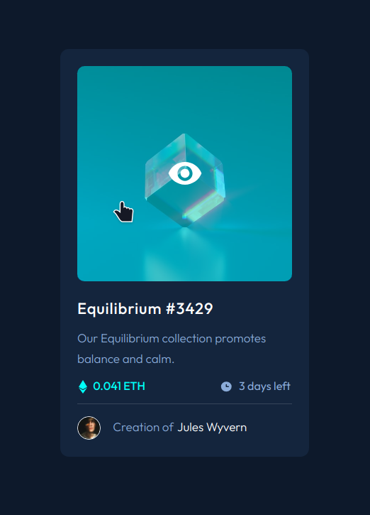

# Frontend Mentor - NFT preview card component solution

This is a solution to the [NFT preview card component challenge on Frontend Mentor](https://www.frontendmentor.io/challenges/nft-preview-card-component-SbdUL_w0U). Frontend Mentor challenges help you improve your coding skills by building realistic projects. 

## Table of contents

- [Overview](#overview)
  - [The challenge](#the-challenge)
  - [Screenshot](#screenshot)
  - [Links](#links)
- [My process](#my-process)
  - [Built with](#built-with)
  - [What I learned](#what-i-learned)
  - [Continued development](#continued-development)
- [Author](#author)

## Overview

### The challenge

Users should be able to:

- View the optimal layout depending on their device's screen size
- See hover states for interactive elements

### Screenshot

### Links

- [Solution Repo](https://github.com/zh4r/FEM-NFT_Preview_Card)
- [Live Preview](https://zh4r.github.io/FEM/NFT_Preview_Card)

### Built with

- Semantic HTML5 markup
- SCSS
- Flexbox
- Mobile-first workflow
- JS

### What I learned

- Creating an interactive preview pop-up with a small JS Script and some CSS.

### Useful resources

- [Create A Responsive Popup Image Gallery Using HTML CSS And Vanilla Javascript](https://www.youtube.com/watch?v=QghhoJBdw7A) - This helped me with the popup preview.

## Author

- [GitHub Pages - @zh4r](https://zh4r.github.io/)
- [Frontend Mentor -  @zh4r](https://www.frontendmentor.io/profile/zh4r)
- [Upwork](https://www.upwork.com/freelancers/~012011fab05dc8d091)
- [Hire me - piv@zh4r.me](mailto:piv@zh4r.me)
