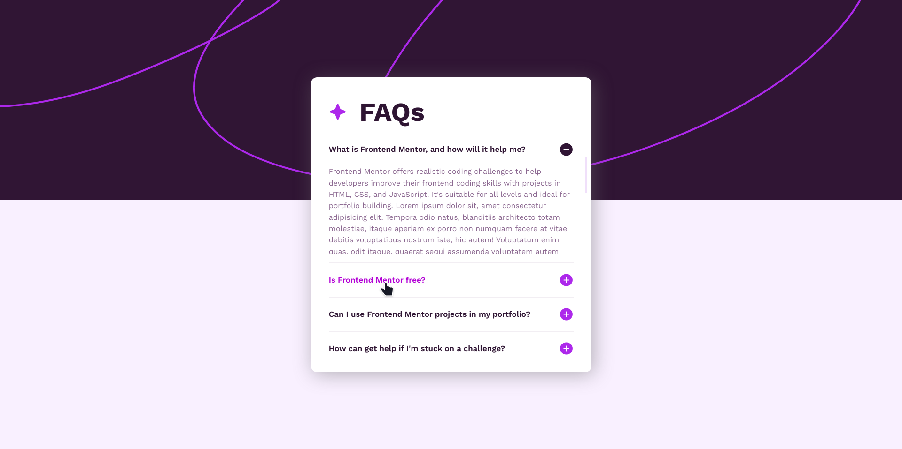
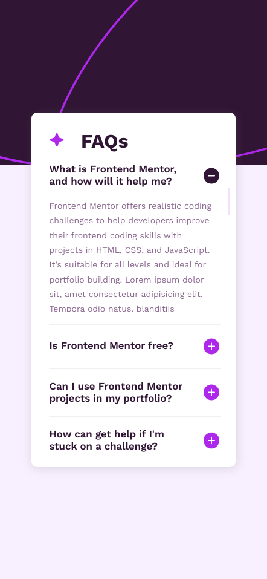

# Frontend Mentor - FAQ accordion solution

This is a solution to the [FAQ accordion challenge on Frontend Mentor](https://www.frontendmentor.io/challenges/faq-accordion-wyfFdeBwBz). Frontend Mentor challenges help you improve your coding skills by building realistic projects. 

## Table of contents

- [Overview](#overview)
  - [The challenge](#the-challenge)
  - [Screenshot](#screenshot)
- [My process](#my-process)
  - [Built with](#built-with)
  - [What I learned](#what-i-learned)
  - [Continued development](#continued-development)
- [Author](#author)

**Note: Delete this note and update the table of contents based on what sections you keep.**

## Overview

### The challenge

Users should be able to:

- Hide/Show the answer to a question when the question is clicked
- Navigate the questions and hide/show answers using keyboard navigation alone
- View the optimal layout for the interface depending on their device's screen size
- See hover and focus states for all interactive elements on the page

### Screenshot

### Links

- Solution URL: [GitHub Repo](https://github.com/zh4r/FeM-FAQ_ACCORDION)
- Live Site URL: [GitHub.io](https://zh4r.github.io/FEM/faq-accordion/index.html)

## My process

### Built with

- Semantic HTML5 markup
- CSS custom properties
- Flexbox
- CSS Grid
- Mobile-first workflow

### What I learned

- How to make an accordion
- Using `tabindex`
- Customizing scrollbar (inside first answer section) 

### Continued development

- Using more JS for fun stuff!
- Understand semantics better.
- Cleaner code.

## Author

- [GitHub Pages - @zh4r](https://zh4r.github.io/)
- [Frontend Mentor -  @zh4r](https://www.frontendmentor.io/profile/zh4r)
- [Upwork](https://www.upwork.com/freelancers/~012011fab05dc8d091)
- [Hire me - piv@zh4r.me](mailto:piv@zh4r.me)
