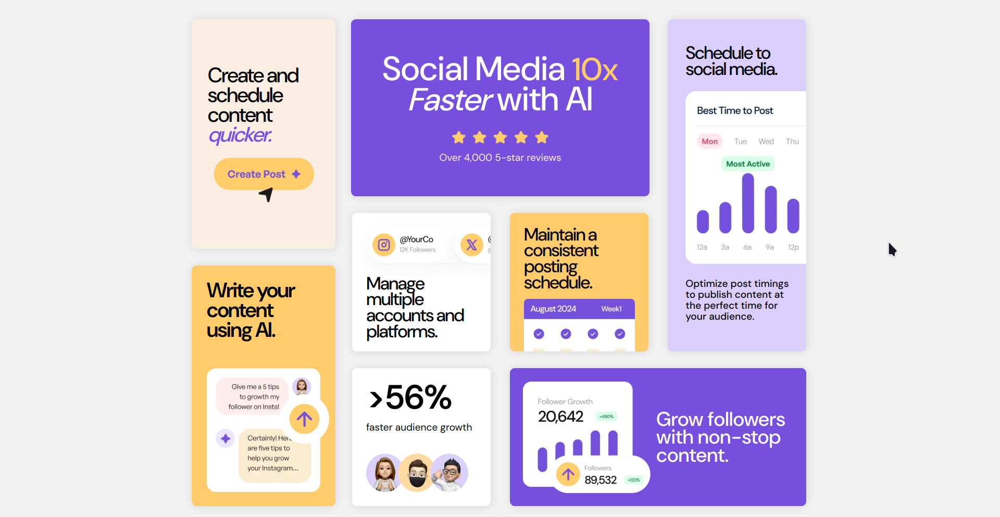

# Frontend Mentor - Bento grid solution

This is a solution to the [Bento grid challenge on Frontend Mentor](https://www.frontendmentor.io/challenges/bento-grid-RMydElrlOj). Frontend Mentor challenges help you improve your coding skills by building realistic projects. 

## Table of contents

- [Overview](#overview)
  - [The challenge](#the-challenge)
  - [Screenshot](#screenshot)
  - [Links](#links)
- [My process](#my-process)
  - [Built with](#built-with)
  - [What I learned](#what-i-learned)
  - [Continued development](#continued-development)
- [Author](#author)

## Overview

### The challenge

Users should be able to:

- View the optimal layout for the interface depending on their device's screen size

### Screenshot

### Links

- [Solution Repo](https://github.com/zh4r/FEM-Bento-grid)
- [Live Preview](https://zh4r.github.io/FEM/bento-grid/index.html)

## My process

### Built with

- Semantic HTML5 markup
- CSS custom properties
- Flexbox
- CSS Grid
- Mobile-first workflow

### What I learned

- Got much more familiar with CSS Grid. Thing is awesome :)

## Author

- [GitHub Pages - @zh4r](https://zh4r.github.io/)
- [Frontend Mentor -  @zh4r](https://www.frontendmentor.io/profile/zh4r)
- [Hire me](https://www.upwork.com/freelancers/~012011fab05dc8d091)