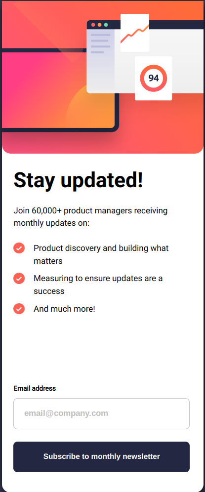

# Frontend Mentor - Newsletter sign-up form with success message solution

This is a solution to the [Newsletter sign-up form with success message challenge on Frontend Mentor](https://www.frontendmentor.io/challenges/newsletter-signup-form-with-success-message-3FC1AZbNrv). Frontend Mentor challenges help you improve your coding skills by building realistic projects. 

## Table of contents

- [Overview](#overview)
  - [The challenge](#the-challenge)
  - [Screenshot](#screenshot)
  - [Links](#links)
- [My process](#my-process)
  - [Built with](#built-with)
  - [What I learned](#what-i-learned)
  - [Continued development](#continued-development)
- [Author](#author)

## Overview

### The challenge

Users should be able to:

- Add their email and submit the form
- See a success message with their email after successfully submitting the form
- See form validation messages if:
  - The field is left empty
  - The email address is not formatted correctly
- View the optimal layout for the interface depending on their device's screen size
- See hover and focus states for all interactive elements on the page

### Screenshot

### Links

- [Solution Repo](https://github.com/zh4r/FEM-NewsletterSignUp)
- [Live Preview](https://zh4r.github.io/FEM/NewsletterSignUp/index.html)

## My process

### Built with

- Semantic HTML5 markup
- CSS custom properties
- Flexbox
- Mobile-first workflow
- JS

### What I learned

- Learned about Enter key functionality.
- Learned about email validation regex and functions.
- First I made 2 html files for the mail input page and the success message page, but then I decided to consolidate them into a single page and hide/show the main page and the success message.

### Continued development

- I love JS! I want more!
- I think my CSS is very messy and confusing, I need to work on that.

## Author

- [GitHub Pages - @zh4r](https://zh4r.github.io/)
- [Frontend Mentor -  @zh4r](https://www.frontendmentor.io/profile/zh4r)
- [Hire me](https://www.upwork.com/freelancers/~012011fab05dc8d091)
